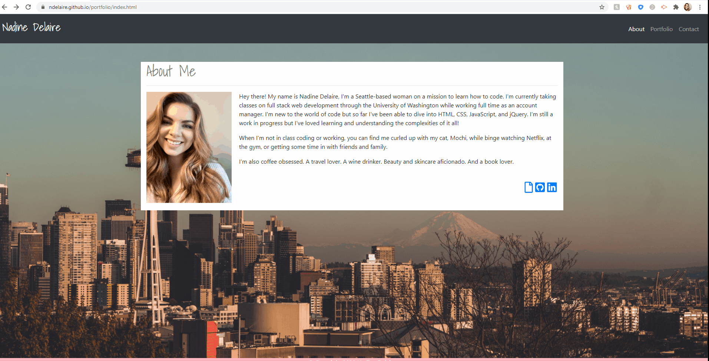
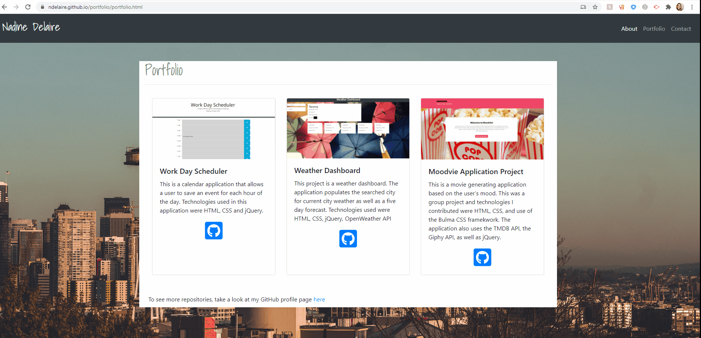
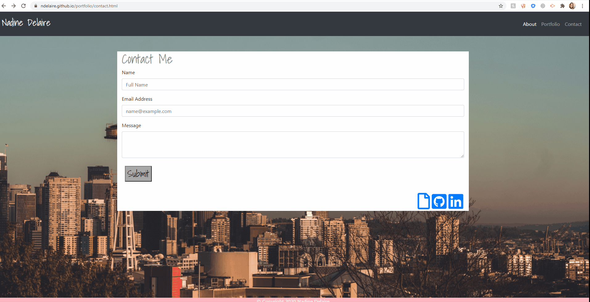

# Portfolio 
* You can take a look at the [project page](https://github.com/ndelaire/portfolio)
* View the [GitHub page](https://ndelaire.github.io/portfolio/) 

## Table of Contents

* Project Overview 
* HTML 
* CSS 
* Frameworks
* License
* Contact

## Project Overview
This project is a continuation of the Homework 2: Responsive Portfolio. This updated version of my portfolio has an updated About Me, links to projects on the Portfolio page, and additions to the Contact page. The About Me page has links to my resume, GitHub, and LinkedIn. The Portfolio page has three projects included on the page. The screenshots at the top of the card are clickable and will take a user to the deployed project and there is a GitHub icon on each that will take a user to the specific repo. The Contact page also has links to my resume, GitHub, and LinkedIn. The technologies used on my portfolio are HTML, CSS, and Bootstrap CSS Framework to style and design the layout. 

About Me   
Portfolio Page   
Contact Page 

## HTML
HTML was created for three separate files: index.html, contact.html, and portfolio.html. For the index.html file, Bootstrap was used to create a navbar, I utilized the grid system to contain the About Me section and to add a fixed footer. 

The same was done for the contact.html and portfolio.html but with a few modifications. I used a Bootstrap form for the Contact Me container and Bootstrap Card Deck for the portfolio. I used Font Awesome to add the icons for a resume link, GitHub link, and LinkedIn link. 

## CSS
CSS was utilized to cover the background, add in my picture, and change the font in the nav bar as well as the Contact Me and Portfolio pages. 

## Frameworks
Use of Bootstrap CSS Framework 

## License 
None at this time

## Contact
Nadine Delaire - ndelaire16@gmail.com 
Project Link:  https://ndelaire.github.io/portfolio/

